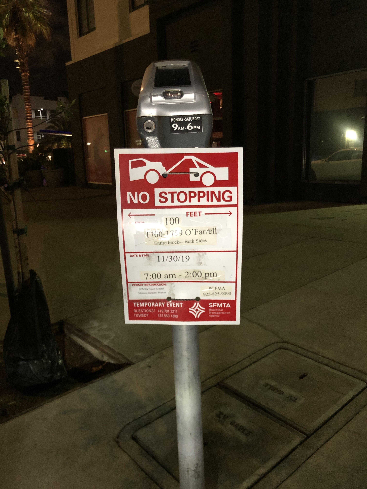

# Parking or not
ML based parking sign processing application

## Tell us what your idea is.
If you are driving in the city, often time you would find yourself confused by parking signs like these:

This project is to build an Android application, which uses Machine Learning to help recognize the words and translate those into rules of parking, then based on the context (e.g. time of the day, type of your vehicle) the app will output a result that a human will be able to understand: can you park your car here or not?

## Tell us how you plan on bringing it to life. 
Currently, the project is at ideation stage, but that does not mean it’s far away from brought to life. Here is the timeline on how it can be done (and how to get it done with Google’s help):
- Dec 2019
  - Data is very important for machine learning. We would spend some time to collect enough data set, via online resource and in-person collection on the road.
  - Understand the different types of rules that parking signs would have
  - Label the data set and format the output in a reasonable concise format
- Jan 2020:
  - User research on the ideal user experience of the Android app that users would use
  - Prototype the Android app to build the proof of concept via cloud vision API to detect text in images, which would allow user to capture the parking sign and output the text in it (without rule calculation yet)
  - Build naive parking rule engine to take text in the parking sign and translate those into certain basic rules (e.g. invalid parking time of the day and date range), and use this engine to make the Android app able to solve use case with simple parking sign.
- Feb 2020:
  - With Google’s help, we could make parking rule engine much more automated with training data set, so that we don’t need to setup different rules manually.
  - Another example of using Google’s help would be able to use TensorFlow Lite to output the result realtime from camera viewfinder
- Mar 2020: 
  - Build the improvement above (with Google’s help) into the Android app using TensorFlow Lite model, and tested with new parking sign in the real world
  - Improve the machine learning model with more data set and fine tune the parameters
- Apr 2020:
  - Tested with limited alpha test users and collect user feedback
  - Improve the user experience based on user feedback
  - Improve the model with more data that alpha test users provided

In addition, the team had experience on industry Android application development and academic machine learning knowledge, which will definitely help deliver the project in time.

## Tell us about you.
We (Zhongyu Wang and Zihan Guo) are two software engineers from Uber and Asana, and we previously worked at Google and Microsoft Research. 

As of mobile experience, Zhongyu worked on both Rider app and Driver app at Uber for the past 4 years, and Zihan worked on Asana android app for the past 2 years (the full projects list can be found [here](https://github.com/ZongZiWang/parking-or-not/blob/master/PREVIOUS_PROJECTS.md)).

As of machine learning experience, Zhongyu did a project at Google to use Google Brain to generate app collection recommendation for Google Play content.
